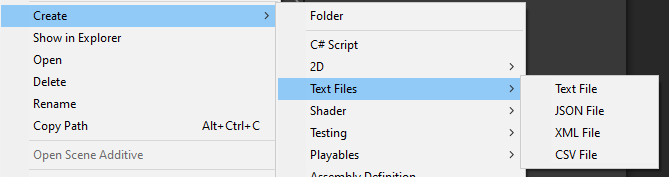

# Project Window Extensions
This aims to improve the usability of the project window.

## Installation
- OpenUPM
  - `openupm add com.nomnom.project-window-extensions`
- Package Manager
  - Add through git url `https://github.com/nomnomab/Project-Window-Extensions.git`

### Package Settings
- Parts of this package can be enabled/disabled via the preferences menu, located in `Edit/Preferences/Project Window Extensions`

## Current Enhancements

#### Copy/Paste/Cut Support
- Allows for copying, pasting, and cutting assets directly in the editor
- Works for folders and assets.
- Default keybinds
  - These keybinds will need to be rebound via the `Shortcut Manager` due to it conflicting with Unity's native keybinds

  | Action | Keybind |
  |---|---|
  | Copy | Ctrl-C |
  | Paste | Ctrl-V |
  | Cut | Ctrl-X |
  | Copy - Cancel | Ctrl-Shift-C |
  | Cut - Cancel | Ctrl-Shift-X |

- Gives a visual when in either copy or cut mode
- Works in both single and double column mode
- Can be found under `IO/*`
#### Copy Mode

#### Cut Mode

### Additional Create Options
- Added types:
  - Text File
  - JSON File
  - XML File
  - CSV File
- Can be found under `Create/Text Files/*`

## Additional Information
- [Trello Board](https://trello.com/b/h7sMCsTR/my-packages)